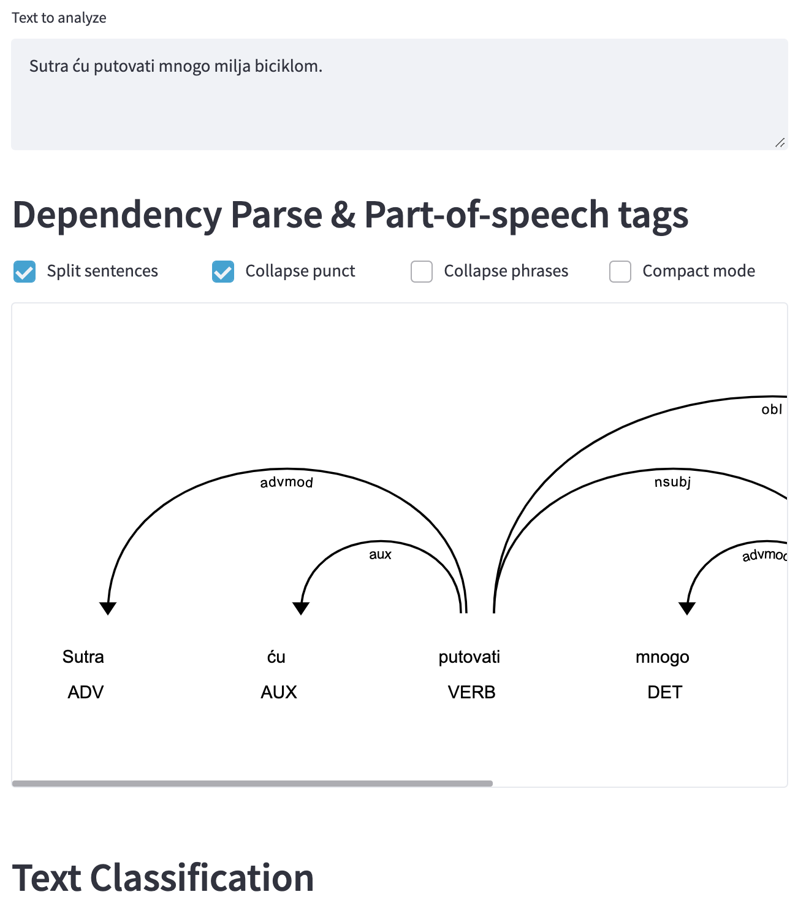

# streamlit_serb
Streamlit project, showcasing usage of Stanza models for diagramming
sentences.

Pulls my customized spacy-streamlit.git@allow_stanza branch, uses a
Serbian language sentence for demonstration.

[Streamlit Demo](https://share.streamlit.io/apsears/streamlit_spacy_stanza/main/spacy_sr.py)

